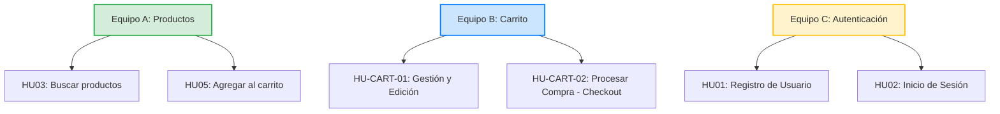

# 📊 Panel de Control: Evaluación de Riesgos y Métricas
## Actividad de Laboratorio: "Evaluación de Riesgos y Métricas en el Tablero Ágil"

Este documento es el panel de control interactivo para los **Equipos A, B y C**. Conecta la planificación ágil (Trello), el análisis de riesgos y la implementación de pruebas automatizadas con **Playwright** para la plataforma [Automation Exercise](https://automationexercise.com/).

---

## 🎯 1. Objetivos del Laboratorio
1. **Alinear Negocio y Calidad:** Utilizar la evaluación de riesgos funcionales y no funcionales para decidir qué probar, cómo probar (UI, API o Híbrido) y a qué darle prioridad.
2. **Monitorear la Calidad en Tiempo Real:** Configurar y actualizar métricas clave que reflejen la estabilidad del código ante las pruebas automatizadas ejecutadas en el pipeline de CI/CD.
3. **Colaborar como un Equipo Scrum:** Utilizar Trello para el flujo de trabajo y este documento como único punto de verdad para el reporte de fallos y consolidación.

---

## 👥 2. Distribución de Equipos y Alcance (6 HUs)

Cada equipo tiene bajo su responsabilidad un componente específico del sistema y 2 Historias de Usuario (HUs) detalladas:



---

## 📈 3. Diccionario de Métricas del Pipeline

Durante el Sprint, los equipos deberán medir y actualizar diariamente las siguientes métricas basadas en los resultados de Playwright en GitHub Actions y las tarjetas en Trello:

| Métrica | Fórmula de Cálculo | Fuente de Datos | Frecuencia | Objetivo (KPI) |
| :--- | :--- | :--- | :--- | :--- |
| **Tasa de Paso/Fallo (Pass/Fail Rate)** | `(Pruebas Exitosas / Total Pruebas) * 100` | GitHub Actions (Pipeline) | Diaria | $\ge 95\%$ de éxito |
| **Densidad de Defectos** | `Bugs en Trello (Etiqueta Roja) / HUs Entregadas (Etiqueta Verde)` | Tablero Trello | Fin de Iteración | $< 0.3$ bugs por HU |
| **Cobertura de Riesgos Mitigados** | `(Riesgos con Pruebas / Total de Riesgos Identificados) * 100` | Trello + Código | Fin de Sprint | $100\%$ de Riesgos Críticos |

---

## 🚀 4. Guía de Interacción para Estudiantes

Para completar con éxito la práctica, sigan este flujo de trabajo dentro del equipo:

```
┌──────────────────────────┐     ┌──────────────────────────┐     ┌──────────────────────────┐
│   Paso 1: Trello         │     │   Paso 2: Taller Riesgos │     │   Paso 3: Automatización │
│ Mover las 2 HUs a        │ ──> │ Evaluar Riesgo Funcional │ ──> │ Definir alcance:         │
│ columna "Por hacer".     │     │ y No Funcional en la HU. │     │ Crítico (UI+API) /       │
└──────────────────────────┘     └──────────────────────────┘     │ Bajo (Solo API).         │
                                                                  └──────────────────────────┘
                                                                                │
                                                                                ▼
┌──────────────────────────┐     ┌──────────────────────────┐     ┌──────────────────────────┐
│   Paso 6: Actualizar KPI │     │   Paso 5: Reportar Bugs  │     │   Paso 4: Ejecución CI   │
│ Calcular tasa de paso y  │ <── │ Registrar fallos en las  │ <── │ Correr pruebas en local  │
│ densidad de defectos.    │     │ tablas de este archivo.  │     │ y GitHub Actions.        │
└──────────────────────────┘     └──────────────────────────┘     └──────────────────────────┘
```

> [!IMPORTANT]
> **Regla de Priorización del Esfuerzo:**
> *   **Riesgo Global Crítico (Rojo):** Obligatorio crear **Pruebas Híbridas** (Flujo de UI en Playwright + Aserciones y Validaciones directas vía API).
> *   **Riesgo Global Menor (Verde):** Permitido automatizar únicamente un **smoke test rápido** por API o flujo de UI simplificado para optimizar el esfuerzo.

---

## 🔍 5. Registro de Fallos Detectados por Playwright (A Completar por Equipos)

*Los equipos deben registrar aquí cada anomalía, fallo de aserción o bug encontrado por Playwright durante las ejecuciones automáticas:*

### 🟢 Equipo A - Componente: Productos (HU03, HU05)
| ID Bug | Fecha | Historia de Usuario | Tipo de Prueba | Descripción del Fallo (Detallado) | Impacto | Estado |
| :--- | :--- | :--- | :--- | :--- | :--- | :--- |
| *EJ-A1* | 2026-06-29 | HU03 | API | El endpoint `/api/searchProduct` responde `200 OK` pero cuerpo vacío ante caracteres especiales en lugar de control de error. | Media | 🔴 Abierto |
| | | | | | | |

### 🔵 Equipo B - Componente: Carrito (HU-CART-01, HU-CART-02)
| ID Bug | Fecha | Historia de Usuario | Tipo de Prueba | Descripción del Fallo (Detallado) | Impacto | Estado |
| :--- | :--- | :--- | :--- | :--- | :--- | :--- |
| *EJ-B1* | 2026-06-29 | HU-CART-01 | UI (E2E) | Al añadir más de 2 productos de forma consecutiva muy rápido, el modal se congela y no se añaden los ítems (Race Condition). | Alta | 🔴 Abierto |
| *EJ-B2* | 2026-06-29 | HU-CART-01 | API | La llamada `/api/addToCart` (simulada) responde con latencias superiores a 3000ms violando el SLA. | Alta | 🟡 Investigando |
| | | | | | | |

### 🟡 Equipo C - Componente: Signup / Login (HU01, HU02)
| ID Bug | Fecha | Historia de Usuario | Tipo de Prueba | Descripción del Fallo (Detallado) | Impacto | Estado |
| :--- | :--- | :--- | :--- | :--- | :--- | :--- |
| *EJ-C1* | 2026-06-29 | HU01 | UI (E2E) | Tras registrar un usuario, el botón de continuar a la página principal no redirige correctamente y se queda en la pantalla de éxito. | Alta | 🔴 Abierto |
| | | | | | | |

*Nota: Reemplacen o agreguen filas a las tablas según los fallos reales o simulados detectados en su iteración.*

---

## 📊 6. Resumen Consolidado de la Iteración

*Actualicen los contadores consolidados al finalizar la práctica para evaluar si se cumplieron los KPIs:*

| Equipo | HUs en Sprint | Riesgos Identificados | Pruebas Creadas (UI / API) | Bugs Reportados | HUs Completadas |
| :--- | :---: | :---: | :---: | :---: | :---: |
| **Equipo A** | 2 | 0 | 0 / 0 | 0 | 0 |
| **Equipo B** | 2 | 0 | 0 / 0 | 0 | 0 |
| **Equipo C** | 2 | 0 | 0 / 0 | 0 | 0 |
| **Global** | **6** | **0** | **0 / 0** | **0** | **0** |

### 🚨 Indicadores de Calidad Finales:
*   **Tasa de Paso Final (Promedio Global):** `0%` (Objetivo: $\ge 95\%$)
*   **Densidad de Defectos Global:** `0.0` (Objetivo: $< 0.3$)
*   **Cobertura de Riesgos Mitigados:** `0%` (Objetivo: $100\%$ de riesgos críticos con pruebas automatizadas)

---
*Última actualización por el PM: 2026-06-29 07:30:00 (Local Time)*
